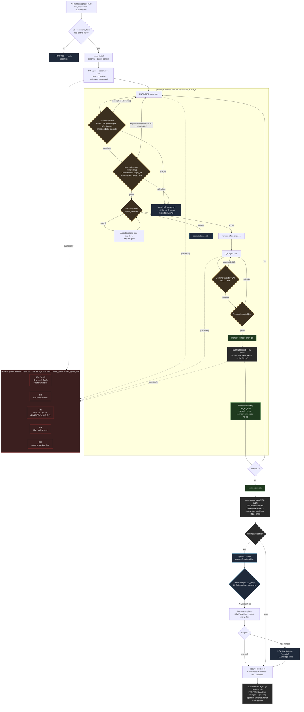

# Control-flow map — checks, gates & control actions

> Visual companion to the R-rules table (CLAUDE.md), the doctrine-spec
> registry (`webapp/backend/app/services/doctrine_spec.py`, I-2) and
> `WORKFLOW.md`. Every rule shown maps to a real enforcement point.
> Generated 2026-06-04.

Two enforcement layers:
- **Streaming-time (Tier 1.5)** — the harness reads the agent's `stream-json`
  live and **kills the subprocess** before it can do harm.
- **Post-agent gates** — after the subprocess returns, the orchestrator runs
  validators/gates and **blocks the merge** unless they pass.

Plus **sprint-level** checks (pre-flight, acceptance, closure, doctrine-meta).

## Legend — who enforces what

| Color | Meaning | Examples |
|---|---|---|
| 🔴 red | **Streaming kill** (automatic, mid-run) | Tier 1.5 / R5, R8, R12, R13, B5 |
| 🟠 orange | **Post-agent gate** (automatic, blocks merge) | doctrine validator (R10.1), regression gate (R10/R10.2), FF check (A1) |
| ⚪ gray | **Quality / advisory** (signal, not a block) | scorer rubric R7, acceptance, coverage, R9 (unenforced) |
| 🔵 blue | **Operator-gated** (never automatic) | Review & merge, verdicts, Dispatch fix, doctrine approval, skip_gate |
| 🟢 green | terminal / success states | bl.done(merged_full), sprint_complete |

## Enforcement points (from the I-2 registry)

| Rule | Where | Enforced |
|---|---|---|
| R5 grounding floor | `doctrine_validator:_count_grounded_retrieval` (post) + Tier 1.5 (streaming) | ✅ |
| R5b citations | `doctrine_validator:_check_citations` (post) | ✅ |
| R7 rubric self-consistency | `doctrine_validator:validate_scorer` (post) | ✅ (signal) |
| R8 retrieval budget | `claude_agent:MAX_RETRIEVAL_CALLS_DEFAULT` (streaming) | ✅ |
| R9 ≥1 graph_* call | streaming | ❌ advisory gap (A8) |
| R10 / R10.2 gate retries | `orchestrator:_engineer_flow` | ✅ |
| R10.1 doctrine retries | `orchestrator:_qa_or_scorer_flow` | ✅ |
| R11 no-op short-circuit | `doctrine_validator:validate_engineer` | ✅ |
| R12 scorer grounding | `claude_agent:stream_agent_task` (streaming) | ✅ |
| R13 no history-rewrite git | `claude_agent:FORBIDDEN_GIT_RE` (streaming) | ✅ |
| R15 dispatch-at-most-once | `orchestrator:_select_followup_candidates` | ✅ |
| Tier 1.5 pre-mod kill | `claude_agent:stream_agent_task` (streaming) | ✅ |

> The registry + a CI consistency test keep this map honest: a documented
> R-rule with no enforcement point + resolvable check fails the build.
