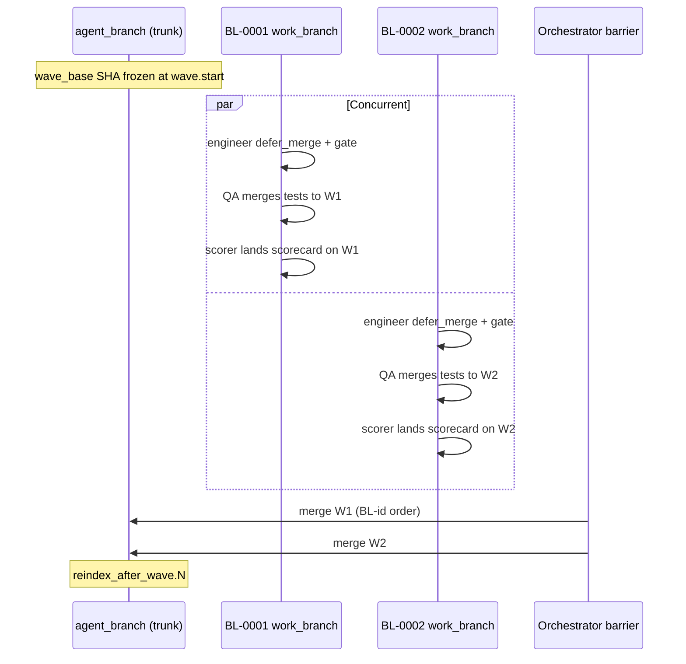

# Wave Concurrency — Technical Assessment 01

> **Author:** architect (Grok). **Date:** 2026-06-14. **Scope:** current
> implementation on branch `wave-concurrency` (tip `6c5f45e` at time of
> writing). **Sources:** `orchestrator.py`, `git_worktree.py`,
> `PROPOSAL_WAVE_CONCURRENCY.md`, `CONTINUATION_PROMPT.md`, concurrency
> unit tests (22/22 pass on Mac checkout), commit messages, handoff ledger.

---

## Executive verdict

**Confidence: ~85% on "core happy-path is sound"; ~95% on "not merge-ready yet."**

The implementation is a coherent **Strategy A** design: isolate per-BL work on
branches, parallelize engineer/QA/scorer, serialize trunk integration at the
barrier in BL-id order. Unit tests and one live proof
(`run-20260615T010822Z-36f623`, 2 disjoint BLs, `wave_concurrency=2`) validate
the architecture.

It is **not yet production-complete** per the proposal's own 95% gate:
conflict-path live proof, scale proof, several §3.3/§3.4 items, and one
outcome-aggregation honesty gap remain. Branch `wave-concurrency` @ `6c5f45e`
is ahead of `development`/`main` (`50f86d5`).

---

## Architecture map

### Activation gate

Concurrent mode engages only when **all** of these hold:

```python
_concurrent_wave_mode = (wave_execution and wave_concurrency
                         and wave_concurrency > 1 and _waves is not None)
```

(`orchestrator.py` ≈L4418–4419)

Otherwise the existing flattened serial loop runs unchanged
(`wave_concurrency<=1` or `wave_execution=False`).

### Three-layer stack

| Layer | Primitive | Responsibility |
|-------|-----------|----------------|
| **Fan-in** | `_merge_streams` | Run ≤N BL coroutines; merge SSE events; isolate per-BL failures |
| **Per-BL body** | `_one_bl_concurrent` | Engineer (`defer_merge`) → QA → scorer on isolated `agent/{task_id}` branch |
| **Barrier** | `_run_wave_concurrent` + `merge_branch_into_target` | After all BLs drain, merge work-branches onto `agent_branch` in sorted BL-id order |

Effective parallelism:

```
_eff = min(len(wave_bls), wave_concurrency, max(1, cpu_count // 2))
```

### Data flow (one multi-BL wave)



### Key invariant: defer-merge

**Serial path:** engineer FF-merges to trunk immediately after a green gate.

**Concurrent path:** engineer returns early with `deferred_ready` + `work_branch`;
trunk is untouched until assembly (`orchestrator.py` ≈L600–610).

Worktrees are removed in `finally`, but **branches survive**
(`remove_worktree` explicitly leaves the branch in place). That is the
defer-merge contract.

QA and scorer both use `merge_target_override=work_branch` so neither writes
to trunk mid-wave. Commit `6c5f45e` closed a real hole where the scorer
defaulted to `agent_branch` and FF-merged mid-wave, making BL-0001 assemble as
`noop`.

---

## Correctness analysis

### What is solid

#### 1. Interleaving-independent assembly

`_run_wave_concurrent` collects structured `_wave_bl_done` outcomes, then
assembles in `bl_specs` order regardless of finish order. Unit tests
explicitly delay the lower-id BL and still assert BL-id assembly order.

#### 2. Trunk safety during concurrent work

- No concurrent task calls `fast_forward_target` on `agent_branch` during the
  wave (post-`6c5f45e` fix).
- `merge_branch_into_target` aborts on conflict and leaves trunk clean
  (`git merge --abort`). Real-git tests prove disjoint merges succeed and
  overlapping edits surface `conflict` with trunk unchanged.

#### 3. No-abort at the wave level

- `_merge_streams` catches per-factory exceptions as `_stream_error`; siblings
  complete.
- `_one_bl_concurrent` never yields `_wave_abort`; engineer escalation surfaces
  via `_wave_bl_done` and `bl.escalated`, siblings continue.
- Assembly failure appends to `escalated_bls` with `role: "assembly"`; siblings
  already merged stay on trunk.

#### 4. Gate isolation under concurrency

`run_bl_tests` uses a unique compose project per invocation
(`{run_id_prefix}-bl-{uuid8}` or `blgate-{uuid8}`) and a detached gate
worktree. Concurrent per-BL gates should not collide on Docker project names
(not live-stress-tested at k>2).

#### 5. Wave-base consistency

Each concurrent BL reads `wave_base` from `agent_branch` at BL start. During
the wave the trunk is not mutated (by design), so all BLs fork from the same
SHA via `create_worktree(..., base_ref=cfg.agent_branch)`.

### Design deviations from the proposal (minor)

| Proposal | Implementation | Impact |
|----------|----------------|--------|
| Branch name `agentic-work/<run_id>/<bl_id>` | `agent/{task_id}` (existing convention) | None functionally; branches are disposable |
| `_resource_cap()` operator-overridable | Hard-coded `cpu_count // 2` | Low; no env knob |
| Per-wave disk preflight scaled by k | Not implemented | Medium under heavy concurrency |

### Correctness gaps / risks

#### 1. Outcome aggregation honesty (I-5)

`_one_bl_concurrent` emits `bl.done` with `outcome=merged_full` **before**
barrier assembly. If assembly later fails (conflict/error), `bl_outcomes_compact`
still says `merged_full`, while `escalated_bls` carries `role: "assembly"`.

`sprint_complete` emits both lists without reconciling. A consumer trusting only
`bl_outcomes` would over-report success. The proposal's §5 I-5 requirement is
only partially met — assembly failure is visible in `escalated_bls` and
`bl.assembled`, but not reflected back into per-BL outcome labels.

#### 2. Assembly conflict → no-abort *loop* is not wired

Proposal §4/§7 says assembly conflicts should route like merge failures to
Janitor/no-abort. Current behavior:

- Emit `bl.assembled` (ok=false), `bl.escalated` (role=assembly)
- Append to `escalated_bls`
- **No** automatic engineer respawn, Janitor trigger, or conflict-resolution
  agent

The BL's work survives on its work-branch, but recovery is operator/manual.
Unit tests prove surfacing; they do not prove automated repair.

#### 3. Checkpoint / resume (§3.3 largely unimplemented)

Proposal called for `in_flight_bls`, sidecar lock on concurrent checkpoint
writes, and per-BL-branch rollback semantics.

Actual state:

- `_checkpoint` still writes only `current_bl: str | None`
- Concurrent mode sets `current_bl=None` only at wave end, never tracks
  in-flight set mid-wave
- No dedicated test for concurrent checkpoint round-trip (proposal §7 item 4)

`start_bl` resume is supported in the concurrent loop, but mid-wave crash
recovery is weaker than the design spec claims.

#### 4. Resource governance (§3.4 partially implemented)

**Implemented:**

- Semaphore cap via `_merge_streams`
- CPU-based `_eff` cap

**Not implemented:**

- `wave.concurrency_degraded` event when disk preflight would force k down
- Per-wave `per_bl_disk_gb * k` preflight scaling
- Live stress at k≥3 or multi-wave concurrent runs

#### 5. Stale API comment

`projects.py` still says `wave_concurrency>1` is "currently inert until the
fan-in lands" — inaccurate; fan-in is shipped.

#### 6. Single-BL waves use serial path with `_wave_abort`

Degenerate waves (`len==1`) go through `_one_bl` without `concurrent=True`,
preserving abort semantics. Correct, but means single-BL wave behavior differs
from multi-BL wave behavior (abort vs surface-and-continue).

---

## Test coverage matrix

| Area | Coverage | Gap |
|------|----------|-----|
| `_merge_streams` fan-in | 6 unit tests (cap, ordering, failure isolation) | None significant |
| `_run_wave_concurrent` orchestration | 6 unit tests + 5 dispatch tests | Mocks assembler; no full `_one_bl_concurrent` integration |
| `merge_branch_into_target` | 3 real-git tests (disjoint, conflict, noop) | Not wired through full concurrent sprint |
| Scorer defer-merge invariant | AST guard (`test_concurrent_scorer_defer.py`) | Behavioral E2E deferred to live proof |
| `wave_concurrency=1` byte-identical regression | Claimed in design; **no dedicated regression test** | Relies on separate code path + full suite green |
| Live proof | 1 run, 2 disjoint BLs, k=2, single wave | Conflict pair, 3+ BL wave, multi-wave, repeatability |
| Full remote suite | 559 passed per `6c5f45e` commit message | Not re-run at time of this assessment on remote |

**Verification at assessment time (Mac):** 22/22 concurrency-specific tests pass
in 2.31s:

```
tests/test_merge_streams.py
tests/test_run_wave_concurrent.py
tests/test_wave_concurrent_dispatch.py
tests/test_wave_assembly_merge.py
tests/test_concurrent_scorer_defer.py
```

---

## Live proof status (honest ledger)

| Claim | Evidence | Status |
|-------|----------|--------|
| Two BLs run truly concurrently | `run-20260615T010822Z-36f623`: overlapping engineer spawns, both `work_ready` | `[x]` |
| Deterministic assembly | Both merged in BL-id order, 0 conflicts, delivered to `integration` | `[x]` |
| Scorer defer-merge fix | `6c5f45e` + AST test; not re-live-proven post-fix | `[~]` |
| Conflicting pair at assembly | Real-git unit test only | `[ ]` |
| Scale (3+ BL / multi-wave) | None | `[ ]` |
| Acceptance + regression green under concurrency | Live proof was a 2-BL diag sprint, not full acceptance loop | `[~]` |
| Merged to main | Branch isolation | `[ ]` |

Per `PROPOSAL_WAVE_CONCURRENCY.md` §7, concurrency>1 should be reported at
**~70–85%** until the conflicting-pair live gate exists — not 95%.

---

## Component-by-component notes

### `_merge_streams`

Well-implemented. Semaphore gates concurrency; per-stream order preserved;
`finally` cancels tasks on consumer exit. If `run_brief`'s consumer ever breaks
mid-wave without draining, in-flight BL tasks get cancelled — worth confirming
no early-return paths exist in the concurrent loop (currently they drain fully
before assembly).

### `_one_bl_concurrent`

Mirrors serial semantics for engineer gate loop, QA doctrine, scorer read-only
path. Deliberate differences:

- No `pre_bl_sha` trunk rollback (correct — trunk not touched)
- No `_checkpoint(current_bl=bl_id)` per BL
- `merged_no_qa` / `merged_no_score` not assembly-eligible (correct)
- Engineer `no_op` short-circuits without work_branch (correct)

### Barrier assembly

Uses `--no-ff` 3-way merge. Second+ BLs in a wave are genuinely non-FF
relative to trunk (forked from wave-base, not chained). Order matters for
conflicts: BL-id order is the deterministic tie-breaker, not finish order.

### Serial path preservation

When `_concurrent_wave_mode` is false, the code falls through to the existing
`for it in ordered:` loop with per-BL FF-merge, `pre_bl_sha` rollback,
`_wave_abort`, and wave boundary reindex. This is the rollback story: set
`wave_concurrency=1`.

---

## Known bug fixed (follow-up #1)

**Symptom (live proof `run-20260615T010822Z-36f623`):** BL-0001 assembled as
`kind:noop` with commits directly on `integration`; BL-0002 came via a merge
commit — asymmetric defer-merge.

**Root cause:** In `_one_bl_concurrent`, the scorer was invoked via
`_qa_or_scorer_flow` with `base_branch_override=work_branch` but **without**
`merge_target_override`. `_merge_target` defaulted to `cfg.agent_branch`; the
scorer's scorecard-persistence FF-merge landed BL work on the trunk **during the
wave**, bypassing the BL-id-ordered assembly barrier.

**Harm:** Harmless on disjoint BLs; under real sibling file conflict the scorer
would write the trunk in non-deterministic completion order, bypassing
`merge_branch_into_target` conflict handling.

**Fix (`6c5f45e`):** Pass `merge_target_override=work_branch` to the scorer
call (symmetric with QA). Regression guard: `test_concurrent_scorer_defer.py`
(AST-level). 559 tests passed on remote per commit message.

---

## Risk register

| Risk | Severity | Mitigation in code | Residual |
|------|----------|-------------------|----------|
| Mid-wave trunk mutation | **Was High** (scorer leak) | Fixed `6c5f45e` | Re-live-prove |
| Assembly conflict | **Medium** | Detect + abort + escalate | No auto-repair loop |
| Resource blowup (N claude + N gates) | **Medium** | CPU cap, unique compose projects | No disk-scaled preflight; k≤16 allowed |
| Misleading `bl_outcomes` after assembly fail | **Medium** | `escalated_bls` parallel channel | I-5 partial violation |
| Crash mid-wave resume | **Low–Medium** | `start_bl` partial support | No `in_flight_bls` checkpoint |
| Docker.raw exhaustion | **Medium** (historical) | Per-worktree compose reap | Untested at k>2 live |

---

## Merge readiness assessment

**Do not merge `wave-concurrency` → `development`/`main` yet** without at
least:

1. **Conflicting-pair live sprint** — two BLs, same file/line,
   `wave_concurrency=2`; verify `bl.assembled` conflict, trunk deterministic,
   siblings intact, honest `sprint_complete`.
2. **Post-`6c5f45e` live re-proof** — repeat the happy-path 2-BL run to
   confirm scorer fix doesn't regress assembly semantics.
3. **Fix outcome reconciliation** — after assembly, update `bl_outcomes_compact`
   when assembly fails (or introduce a distinct outcome like `assembly_failed`).
4. **Scale smoke** — one run with 3+ BLs in a single wave or concurrent waves
   back-to-back.
5. **Housekeeping** — update `CONTINUATION_PROMPT.md`, stale `projects.py`
   comment, `CLAUDE.md` flag docs.

**Optional but aligned with proposal §3.3/§3.4:**

- `in_flight_bls` checkpoint + sidecar lock
- `wave.concurrency_degraded` + disk-preflight scaling
- Dedicated `wave_concurrency=1` byte-identical regression test

---

## Relationship to wave execution (Phases 1–3)

Wave concurrency is **Phase 5** of the parallel wave program
(`PROPOSAL_PARALLEL_WAVE_EXECUTION.md`). It depends on:

- `wave_execution=True` — R21 DAG grouping, `wave.start`/`wave.done`, barrier
  `reindex_after_wave.<n>`
- R21 PO gate — dependency DAG + interface contracts (file-disjoint BLs within a
  wave are the expected common case)

Concurrency does **not** change:

- Per-BL gate scope (BL's own tests only)
- Acceptance as the one full integration checkpoint
- No-abort / escalation doctrine at the role level
- Doctrine rules — execution mechanics, not a new R-rule

---

## Bottom line

The concurrency implementation is **architecturally sound Strategy A**: the right
primitives (`_merge_streams`, defer-merge, barrier assembly, conflict-safe
merge) are in place, unit-tested at the seams, and live-proven on the easy case
(2 disjoint BLs). The `6c5f45e` scorer fix addressed a real determinism bug
that would have broken conflict handling under load.

What remains is **empirical hardening and honesty polish**: the conflict path
has only git-level unit proof, not a live sprint; scale and resource governance
are thin; checkpoint/resume lags the design; and per-BL outcomes can lie about
assembly success until reconciled.

---

## Appendix: key code locations

| Artifact | Path | Lines (approx.) |
|----------|------|-----------------|
| Fan-in primitive | `webapp/backend/app/services/orchestrator.py` | `_merge_streams` ≈3502 |
| Wave orchestration | same | `_run_wave_concurrent` ≈3546 |
| Per-BL concurrent body | same | `_one_bl_concurrent` ≈3853 |
| Concurrent dispatch | same | `_concurrent_wave_mode` ≈4418 |
| Engineer defer_merge | same | `_engineer_flow` ≈474, 600–610 |
| Barrier merge | `webapp/backend/app/services/git_worktree.py` | `merge_branch_into_target` ≈264 |
| API flag | `webapp/backend/app/routers/projects.py` | `wave_concurrency` ≈1233 |
| Design doc | `PROPOSAL_WAVE_CONCURRENCY.md` | full |
| Handoff state | `CONTINUATION_PROMPT.md` | 2026-06-15 |